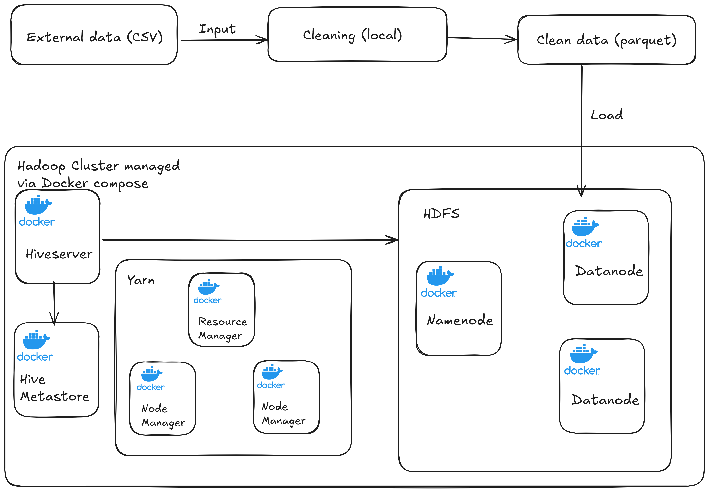

# MIMIC Healthcare Data Analytics

## Overview
This project simulates a Hadoop cluster environment using Docker Compose. Its primary purpose is to provide a platform for processing and analyzing large datasets, with a focus on healthcare-related data as indicated by table names such as 'patients' and 'admissions'. The simulation includes a comprehensive data cleaning pipeline implemented in Python and integrates with Apache Hive for data warehousing tasks, allowing for structured data storage and SQL-based querying.

## Scope
### Current capabilities:
*   Setting up a multi-node Hadoop cluster (HDFS, YARN, ResourceManager, NodeManager, HistoryServer) and Hive services (Server, Metastore) using Docker Compose.
*   A Python-based data cleaning pipeline (located in `data_cleaning/`) that processes raw CSV files (e.g., patients, admissions, chartevents, labevents, prescriptions, diagnoses_icd, d_items, d_labitems), performs transformations (such as data type conversions, handling missing values, and merging columns), and outputs the cleaned data in Parquet format to the `./processed_data/` directory.
*   HQL scripts (located in `hive-hql/`) for creating a data warehouse schema, including dimensional and fact tables, within Hive. These scripts also handle loading the processed Parquet data from `./processed_data/` into the defined Hive tables.

### Out of Scope (for now, but can be Future Work):
*   Actual MapReduce job execution beyond the internal operations performed by Hive.
*   Real-time data streaming or processing capabilities.
*   Advanced data analytics or machine learning model training.
*   A dedicated user interface for interacting with the system, beyond the standard web UIs provided by Hadoop and Hive.

## Architecture Overview
The project is structured around a Dockerized Hadoop ecosystem and a local Python-based data cleaning pipeline.

**Main Components:**

*   **Dockerized Hadoop Cluster:**
    *   **HDFS (Hadoop Distributed File System):** Manages distributed storage across nodes.
        *   `Namenode`: Master node for HDFS, manages the file system namespace and regulates access to files by clients.
        *   `Datanode`: Worker nodes that store actual data blocks.
    *   **YARN (Yet Another Resource Negotiator):** Manages cluster resources and schedules user applications.
        *   `ResourceManager`: Global master for YARN, manages resources across all applications in the system.
        *   `NodeManager`: Agent on each slave machine, responsible for containers, monitoring their resource usage (CPU, memory, disk, network) and reporting the same to the ResourceManager.
    *   `HistoryServer`: Provides a web UI to view the history of MapReduce jobs.
*   **Hive:** Facilitates data warehousing and SQL-like querying over data in HDFS.
    *   `Hive Server (HiveServer2)`: Enables clients to execute queries against Hive.
    *   `Hive Metastore`: Stores metadata for Hive tables (schemas, locations, etc.). This project uses a PostgreSQL database as the backend for the Metastore for persistence.
*   **Data Cleaning Pipeline:**
    *   `Python scripts` (located in `data_cleaning/`): These scripts run in a local Python environment. They are responsible for ingesting raw data (typically CSV files), performing cleaning and transformation tasks, and then outputting the processed data as Parquet files.

**Data Flow and Component Interaction:**

1.  **Raw Data Ingestion:** External data sources (e.g., CSV files) are fed into the Python data cleaning scripts.
2.  **Local Data Cleaning:** The Python scripts perform various transformations (handling missing values, data type conversion, etc.).
3.  **Processed Data Storage (Local):** The cleaned data is saved locally in the `./processed_data/` directory in Parquet format.
4.  **Loading to HDFS:** The processed Parquet files from `./processed_data/` are then manually or via script copied into the HDFS layer of the Dockerized Hadoop cluster.
5.  **Hive Table Creation & Querying:**
    *   Hive uses the Metastore (backed by PostgreSQL) to retrieve table schemas and data locations.
    *   Hive Server (HiveServer2) executes queries, reading data directly from HDFS.
    *   YARN manages the resources for Hive queries (which often translate to MapReduce or Tez jobs).

**System Architecture:**


## Directory Structure
- **`.gitignore`**: Specifies intentionally untracked files that Git should ignore.
- **`data_cleaning/`**: Contains Python scripts for cleaning and transforming raw data.
    - `main.py`: Main script to orchestrate the data cleaning process for all relevant tables.
    - `cleaning.py`: Houses the specific cleaning functions applied to each individual data table (e.g., handling missing values, type conversions for 'patients', 'admissions' tables).
    - `config.py`: Contains configuration settings for the data cleaning process, such as mappings between raw data files and cleaning functions, and parameters for Parquet file output.
    - `schemas.py`: Defines the Apache Arrow schemas that are enforced after data cleaning, ensuring consistency for the Parquet files.
    - `utils.py`: Provides utility functions used across the data cleaning scripts (e.g., logging, file helpers).
    - `requirements.txt`: Lists the Python dependencies required to run the scripts in the `data_cleaning/` directory (e.g., pandas, pyarrow).
- **`docker-compose.yml`**: The Docker Compose file that defines and configures all the services, networks, and volumes for the multi-container Docker application. This includes services for Hadoop (Namenode, Datanode, ResourceManager, NodeManager, HistoryServer) and Hive (Hive Server, Hive Metastore, PostgreSQL backend for Metastore).
- **`env/`**: Contains environment configuration files used by Docker Compose to set environment variables for the various services.
    - `core.env`: Environment variables for Hadoop Core components.
    - `hdfs.env`: Environment variables specific to HDFS (e.g., replication factor, paths).
    - `hive.env`: Environment variables for Hive services (e.g., Hive Metastore connection details if not using an embedded one, Hive Server configurations).
    - `mapred.env`: Environment variables for MapReduce settings.
    - `yarn.env`: Environment variables for YARN (e.g., memory allocation for containers).
- **`hive-hql/`**: Contains Hive Query Language (HQL) scripts used for defining the data warehouse structure and loading data.
    - `create_dwh.sql`: HQL script to create the main database (data warehouse) in Hive.
    - `create_dim_tables.sql`: HQL scripts to define the schema for dimension tables within the data warehouse.
    - `create_fact_tables.sql`: HQL scripts to define the schema for fact tables and often include statements to load data from HDFS into these tables.
- **`data/`** (Conventional): Suggested directory where users should place their raw input CSV files (e.g., `patients.csv`, `admissions.csv`). This directory is typically gitignored.
- **`processed_data/`** (Conventional): The default output directory where the Python scripts in `data_cleaning/` save the processed Parquet files. This directory is also typically gitignored.

## Setup Instructions
### Prerequisites
- **Docker:** Download and install from [https://www.docker.com/get-started](https://www.docker.com/get-started).
- **Docker Compose:** Follow the installation guide at [https://docs.docker.com/compose/install/](https://docs.docker.com/compose/install/).
- **Python 3.x:** Required for running the data cleaning scripts. Ensure Python 3 is installed and accessible.
- **`pip`:** Python's package installer, used for installing Python dependencies. Typically comes with Python 3.x.

### Installation Steps
1.  **Clone the repository:**
    ```bash
    git clone https://github.com/Muhammad-Abdelsattar/MIMIC-Healthcare-Data-Analytics.git mimic_DA
    cd mimic_DA
    ```
2.  **Configure Environment Variables:**
    - The `env/` directory contains template environment files for Docker Compose services (e.g., `core.env`, `hdfs.env`, `hive.env`, `mapred.env`, `yarn.env`).
    - For a local simulation, the default values provided in these files are often sufficient.
    - It's good practice to review these files. For instance, note that within the `docker-compose.yml` file, services like `namenode` and `datanode` have `CORE_CONF_fs_defaultFS=hdfs://namenode:9000`. This internal Docker network DNS name `namenode` correctly points to the Namenode container, and typically does not require changes for local setup.

3.  **Set up Python Environment (for data cleaning):**
    - Install the required Python dependencies from the project root directory:
      ```bash
      pip install -r data_cleaning/requirements.txt
      ```

4.  **Prepare Input Data:**
    - Create a directory named `data` in the project root (if it doesn't already exist):
      ```bash
      mkdir -p data
      ```
    - Place your raw CSV input files (e.g., `patients.csv`, `admissions.csv`, etc.) into this `data/` directory.
    - The data cleaning scripts expect specific file names and structures. Refer to the `data_cleaning/config.py` file or the "Directory Structure" section of this README for the list of expected CSV files. Ensure your input files match these configurations.
    - To download the data: follow [Link](https://physionet.org/content/mimiciii-demo/1.4/)

5.  **Build and Launch the Hadoop/Hive Cluster:**
    - From the project root directory, run the following command:
      ```bash
      docker-compose up -d --build
      ```
    - **`--build`**: This flag tells Docker Compose to build the images before starting the containers. It's recommended for the first time you run the command or if you've made changes to the `Dockerfile` (if any are present and used by `docker-compose.yml`) or to the `docker-compose.yml` itself.
    - **`-d`**: This flag runs the containers in detached mode, meaning they run in the background.

6.  **Verify Cluster Setup (Optional but Recommended):**
    - **Check container status:**
      ```bash
      docker-compose ps
      ```
      Or, for a more general Docker view:
      ```bash
      docker ps
      ```
      You should see all services defined in `docker-compose.yml` (namenode, datanode, resourcemanager, nodemanager, hive-server, hive-metastore, etc.) running.
    - **Access Hadoop NameNode Web UI:** Open your web browser and navigate to `http://localhost:9870`. This UI provides information about the HDFS cluster status, connected Datanodes, and allows you to browse the HDFS file system.
    - **Access YARN ResourceManager Web UI:** Open your web browser and navigate to `http://localhost:8088`. This UI displays information about the YARN cluster, running applications, and node statuses.
    - **Access HistoryServer UI:** The Hadoop HistoryServer UI (typically on port 19888) is not explicitly mapped to the host in the default `docker-compose.yml`. If you need to access it directly from your host machine, you would need to add a port mapping to the `historyserver` service definition in `docker-compose.yml` (e.g., `ports: ["19888:19888"]`). Otherwise, it's accessible from within the Docker network.

## Data Processing Pipeline
The data processing pipeline, implemented with Python scripts in the `data_cleaning/` directory, is responsible for ingesting raw CSV data, performing comprehensive cleaning and transformation operations according to defined schemas, and saving the processed data in Parquet format.

### Running the Pipeline
1.  **Prerequisites:** Ensure your Python 3.x environment is set up and dependencies are installed as detailed in the "Setup Instructions" section (i.e., run `pip install -r data_cleaning/requirements.txt` from the project root).
2.  **Execute the main script from the project root:**
    ```bash
    python data_cleaning/main.py
    ```
    This script will orchestrate the cleaning process for all configured data tables. (Assumes Python 3.x as specified in prerequisites).

### Input
-   Raw CSV files must be placed in the `data/` directory located at the project root.
-   The mapping between expected table names (used internally and for output directory naming) and the actual CSV filenames is defined in `data_cleaning/config.py`. For example, the `patients` table might expect a CSV file named `PATIENTS.CSV`. Please consult this configuration file to ensure your input files are correctly named and placed.

### Process
The Python scripts perform several key cleaning and transformation steps (primarily defined in `data_cleaning/cleaning.py` and orchestrated by `data_cleaning/main.py`):
-   **Dropping Unnecessary Columns:** Removes columns not needed for analysis.
-   **Renaming Columns:** Standardizes column names (e.g., to lowercase, snake_case).
-   **Data Type Correction:** Converts columns to appropriate data types (e.g., strings to integer, float, or datetime objects using Pandas).
-   **Handling Missing Values:** Implements strategies for missing data, such as filling with "Not recorded", `NaN`, `0`, or other appropriate placeholders based on the column's context.
-   **Value Merging/Transformation:** For certain tables like `chartevents`, it can involve merging information from multiple columns (e.g., `valuenum` and `value`) into a single, more usable column.
-   **Date/Time Formatting:** Converts date and time fields into standardized timestamp formats that are compatible with Hive (typically `YYYY-MM-DD HH:MM:SS`).
-   **Schema Enforcement:** Uses schemas defined in `data_cleaning/schemas.py` (Apache Arrow format) to ensure type consistency before saving to Parquet.

### Output
-   The cleaned and transformed data is saved in Parquet format, which is a columnar storage format optimized for use with big data processing frameworks like Hadoop and Spark.
-   Output Parquet files are organized into subdirectories within the `processed_data/` directory at the project root. Each table will have its own subdirectory (e.g., `processed_data/patients/patients.parquet`, `processed_data/admissions/admissions.parquet`).

## Hive Usage
Apache Hive is used as a data warehouse system on top of HDFS. It allows for the processed data to be stored, managed, and queried using SQL-like syntax (HQL).

### Prerequisites
-   The Dockerized Hadoop/Hive cluster must be running. Start it using `docker-compose up -d` from the project root.
-   The data processing pipeline (Python scripts) should have been executed, and the resulting Parquet files should be available in the `./processed_data/` directory.

### Loading Data into HDFS (Manual Step)
The processed Parquet files generated by the Python scripts (located in `./processed_data/`) need to be copied into HDFS.

1.  First, create the main database directory in HDFS:
    ```bash
    docker exec namenode hdfs dfs -mkdir -p /user/hive/warehouse/mimic_dwh.db
    ```
2.  Next, copy the entire `processed_data` directory (containing all Parquet table subdirectories) from your local machine to a temporary location inside the NameNode container:
    ```bash
    docker cp ./processed_data namenode:/tmp/
    ```
3.  Then, put all table data from the NameNode's temporary location into the respective subdirectories within the HDFS database directory. The HQL scripts for table creation expect data to be in subdirectories named after the tables (e.g., `/user/hive/warehouse/mimic_dwh.db/patients/`, `/user/hive/warehouse/mimic_dwh.db/admissions/`, etc.). The `put` command with a wildcard will achieve this if your `processed_data` directory structure is `processed_data/table_name/file.parquet`.
    ```bash
    docker exec namenode hdfs dfs -put /tmp/processed_data/* /user/hive/warehouse/mimic_dwh.db/
    ```
4.  (Optional but recommended) Remove the temporary directory from the NameNode container:
    ```bash
    docker exec namenode rm -r /tmp/processed_data
    ```
**Note:** Ensure your Hive table definitions in the HQL scripts (e.g., `CREATE EXTERNAL TABLE ... LOCATION '/user/hive/warehouse/mimic_dwh.db/table_name'`) correctly point to these HDFS locations.

### Running HQL Scripts to Define Schema
The HQL scripts located in the `hive-hql/` directory are used to create the database and define table schemas.

1.  **Copy HQL scripts to Hive Server:** If you haven't already or if they've changed, copy the HQL scripts into the `hive-server` container:
    ```bash
    docker cp ./hive-hql hive-server:/tmp/
    ```
2.  **Execute HQL Scripts:** Run each script using the `hive -f` command, which executes HQL files directly. This is done via `docker exec` targeting the `hive-server` container:
    ```bash
    docker exec hive-server hive -f /tmp/hive-hql/create_dwh.sql
    docker exec hive-server hive -f /tmp/hive-hql/create_dim_tables.sql
    docker exec hive-server hive -f /tmp/hive-hql/create_fact_tables.sql
    ```
    These scripts create the database (e.g., `mimic_dwh`), define the table structures, and specify the HDFS `LOCATION` where the data for each table resides.

### Querying Data using Hive CLI
Once the data is in HDFS and Hive tables are defined by the HQL scripts, you can interactively query your data using the Hive Command Line Interface (CLI).

1.  **Access the Hive CLI:**
    ```bash
    docker exec -it hive-server hive
    ```
    This command starts an interactive session within the `hive-server` container.

2.  **Run HiveQL Queries:**
    Inside the Hive CLI, you can execute any HiveQL query. For example:
    (Assuming your database is `mimic_dwh` from `create_dwh.sql` and you have a `patients` table)
    ```sql
    USE mimic_dwh;

    SHOW TABLES;

    DESCRIBE FORMATTED patients;

    SELECT * FROM patients LIMIT 10;

    SELECT gender, COUNT(*) as num_patients
    FROM patients
    GROUP BY gender;
    ```

3.  **Exit Hive CLI:**
    When you're done, type `exit;` or `quit;` and press Enter.

## Future Work
Potential future enhancements for this project include:
*   **Automate Data Loading to HDFS:** Develop scripts to automatically transfer processed Parquet files from `./processed_data/` to the appropriate HDFS locations, removing the manual `docker cp` and `hdfs dfs -put` steps.
*   **Containerize Data Cleaning Script:** Package the Python data cleaning pipeline into a Docker image to make it a formal part of the `docker-compose` setup, rather than requiring a local Python environment.
*   **Implement MapReduce/Spark Jobs:** Add examples of custom MapReduce or Spark jobs for more complex data processing or analytics tasks beyond Hive's capabilities.
*   **Advanced Analytics & ML:** Integrate tools or libraries for advanced data analysis, machine learning model training, and serving using the data in HDFS/Hive.
*   **Interactive Dashboard/UI:** Develop a web-based UI (e.g., using Dash/Plotly, Streamlit, or integrating with Superset/Metabase) for easier data exploration and visualization.
*   **Enhanced Security:** Implement Kerberos or other security mechanisms for the Hadoop cluster.
*   **CI/CD Pipeline:** Set up a Continuous Integration/Continuous Delivery pipeline for automated testing and deployment.
*   **Comprehensive Test Suite:** Develop a more thorough testing suite for both the data cleaning scripts and the Hive table structures/queries.
*   **Parameterize HQL Scripts:** Make HQL scripts more flexible by using variables for database names, table names, or paths.

## License

This project is licensed under the MIT License. See the [LICENSE](LICENSE.md) file for details.

[](https://opensource.org/licenses/MIT)
